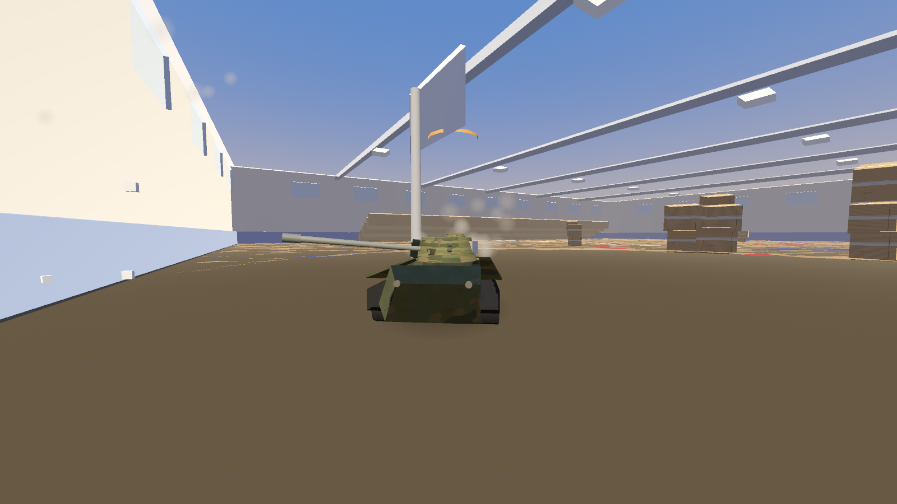
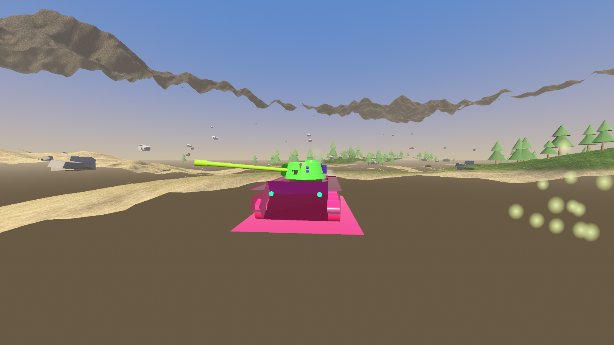
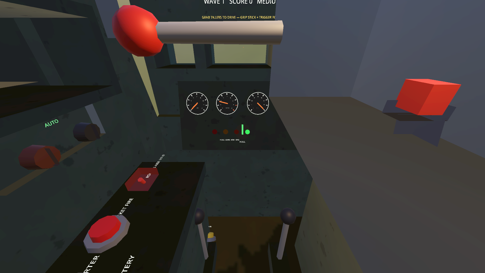
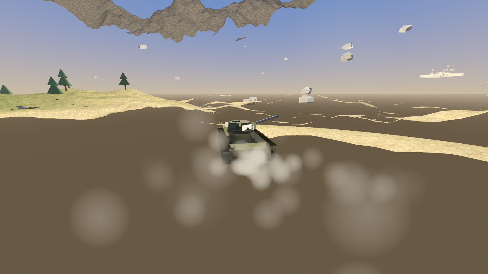
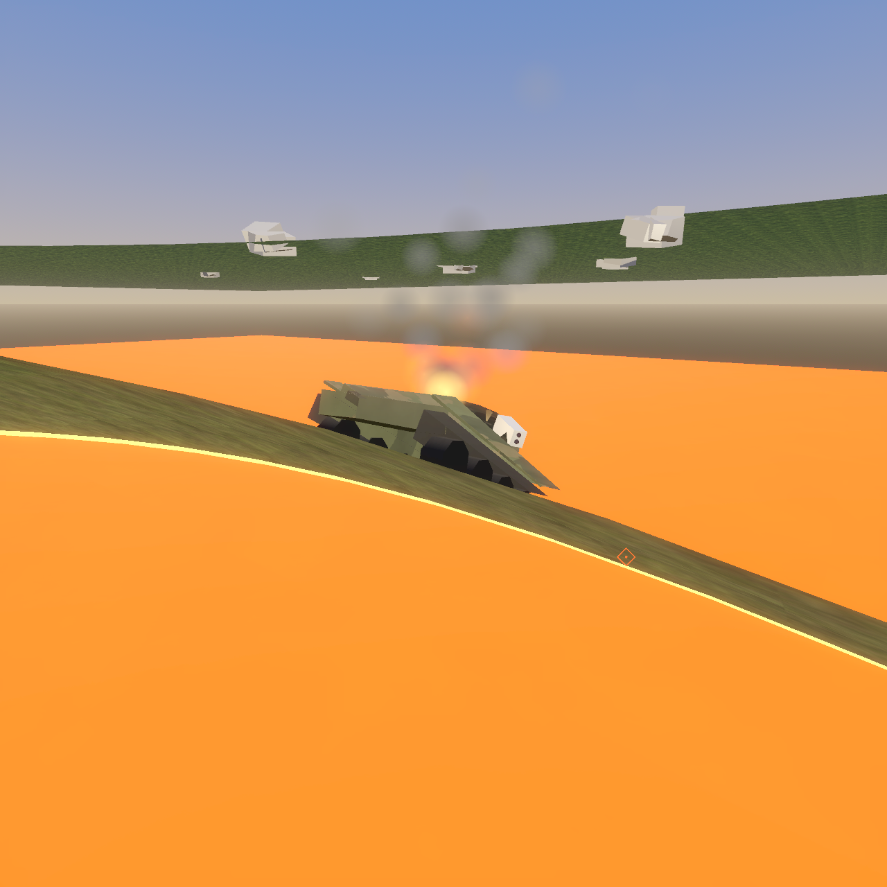
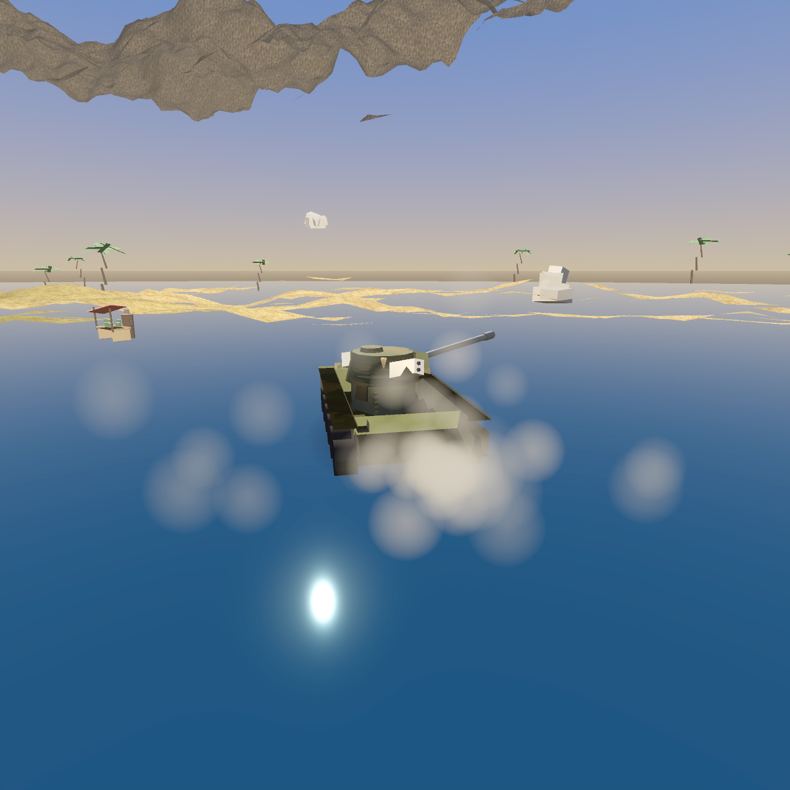

# Tank Commander VR

*Made for Ani* 🧡

A VR tank game for Meta Quest 3, built with [Godot 4](https://godotengine.org/)
(Mobile renderer + OpenXR). You sit inside a one-man turret modeled on real
armored-vehicle crew stations and physically operate everything: flip the
battery master, hold the starter until the engine catches, grab the twin
tillers to drive the tracks, work the turret joystick, cycle the breech lever
to reload the cannon, and arm the rocket console behind its red safety cover.

Every texture and sound is procedurally generated — no external assets.

## Screenshots

| | |
|---|---|
|  |  |
| The cardboard gymnasium | Balloon mode |
|  |  |
| The cockpit (battery → fuel → starter → gear) | Hurricane debris |
|  |  |
| Ridge-bridges over live lava (v0.6.0) | Beach assault | 

More in [docs/EVOLUTION.md](docs/EVOLUTION.md).

## Modes

**Solo** waves on 10 battlefields (outdoor, city, town, mudpit, castle,
gymnasium, beach, island, volcano, baby room) with easy/medium/hard, five
vehicles (tank, plane, biplane, helicopter, runner), day / golden hour /
night-ops stealth, and silly mutators (low-g, underwater, balloon,
paintball). **ENDLESS TOUR** hops to a random new battlefield every three
cleared waves and keeps your score rolling. **Co-op** over LAN: one headset
drives + machine-guns, the other runs the turret. **Versus**: tank duel,
first to five. New players get voice coaching and cockpit hints — veterans
can switch **HELP: OFF** in the menu and the tank computer stops repeating
itself.

## Play

Sideload the APK from [Releases](../../releases) onto a Quest 2/3/Pro:

```
adb install -r -g TankCommanderVR.apk
```

Or build it yourself: Godot 4.7 + the
[godot_openxr_vendors](https://github.com/GodotVR/godot_openxr_vendors) addon
(included), Android SDK 34, JDK 17. Export preset "Meta Quest" is configured
in `export_presets.cfg`.

## Controls

**Physical (the fun way):** grip-grab levers and grips, poke buttons and
switches. Follow the yellow hints on the front wall.

**Hand tracking:** put the controllers down — pinch = trigger, whole-hand
squeeze = grab, poking works the way poking works. Every control in the
game is reachable without buttons. (Runner mode: pump your arms to sprint.)

**Playtest tuning:** every gameplay number lives in `tuning.cfg`
(auto-created in the app's files dir; on Quest:
`/sdcard/Android/data/com.agilelens.tankcommander/files/tuning.cfg`).
Edit, restart, report back.

**Thumbsticks (the easy way):**
| Input | Action |
|---|---|
| X / L-stick click | Auto start ritual (battery + engine) |
| Left stick | Drive (tracks mix automatically) |
| Right stick | Turret traverse / gun elevation |
| Right trigger | Fire cannon (auto-reloads) |
| A (hold) | Coax machine gun |
| B | Fire rocket salvo |
| Y | Recalibrate seat height |

## Performance (measured on Quest 3S)

Golden-hour beach, full combat demo, glow + fill-light on: **locked 72/72 fps,
App GPU 9.2 ms avg of the 13.8 ms budget** (VrApi logcat, v0.6.0). Glow costs
<1 ms on the Adreno 740 — it stays on. Foveation ships at level 2: the A/B
against level 3 measured within run variance, so the sharper periphery is free. Foveation, glow, and 40+ gameplay dials are
runtime-tunable via `tuning.cfg` (see above); `autostart.cfg` in the same dir
boots the game into a self-playing demo scene for hands-off profiling:

```
[auto]
level="beach"
time=1        ; 0 day, 1 golden hour, 2 night
demo=true
delay=6.0
```

## Development

Written overnight by [Claude Code](https://claude.com/claude-code) on the
Agile Lens fleet — desktop-verified via a self-playing screenshot loop, then
exported straight to Quest. Design notes and the full build story live in the
Agile Lens knowledge base.

## License

MIT — see [LICENSE](LICENSE). The bundled `godot_openxr_vendors` addon keeps
its own MIT/Apache licenses (see `addons/godotopenxrvendors/`).
