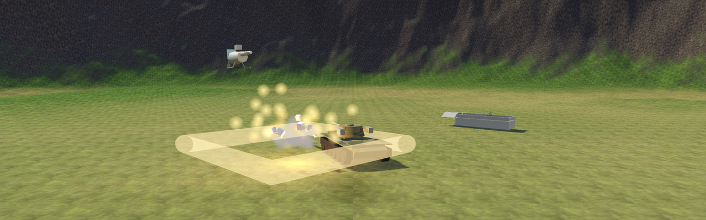

# Tank Commander VR



*Made for Ani* 🧡

A VR tank game for Meta Quest 3, built with [Godot 4](https://godotengine.org/)
(Mobile renderer + OpenXR). You sit inside a one-man turret modeled on real
armored-vehicle crew stations and physically operate everything: flip the
battery master, hold the starter until the engine catches, grab the twin
tillers to drive the tracks, work the turret joystick, cycle the breech lever
to reload the cannon, and arm the rocket console behind its red safety cover.

Every texture and sound is procedurally generated — no external assets.

## Screenshots

| | |
|---|---|
|  |  |
| The cardboard gymnasium | Balloon mode |
|  |  |
| The cockpit (battery → fuel → starter → gear) | Hurricane debris |
|  |  |
| Ridge-bridges over live lava (v0.6.0) | Beach assault | 

More in [docs/EVOLUTION.md](docs/EVOLUTION.md).

## Modes

**Solo** waves on 10+ battlefields (outdoor, city, town, mudpit, castle,
gymnasium, beach, island, volcano — flowing lava, lethal eruptions, killable
baby-room boss) plus a **DEBUG: KITCHEN SINK** level with one of every enemy
type at close range for fast smoke-testing, with easy/medium/hard, seven
vehicles (tank, jeep, boat, plane, biplane, helicopter, runner), fog/rain/
storm weather, day / golden hour / night-ops stealth, and silly mutators
(low-g, underwater, balloon, paintball). **ENDLESS TOUR** hops to a random
new battlefield every three cleared waves and keeps your score rolling.
**On-foot mode**: dismount your vehicle and walk, sprint (arm-swing or a
stick-sprint option), grapple-swing, and climb using pickable items found in
the world (grapple hook, climbing gloves, energy drink, coffee), then climb
back into the seat you left — climbing works on terrain, buildings, rocks,
trees, and castle walls. Pick up one of the newer weapons (a burst SMG, a
mini-howitzer, a close-range spread gun) alongside the pistol and cabbage
grenade. **Co-op** over LAN or an online relay fallback: one headset drives
+ machine-guns, the other runs the turret (seat-swap hotkey to trade), with
a shared round clock and score — both players render as full Rec-Room-style
procedural avatars (hip/head/hand IK, no imported skeletal assets) to each
other, on-foot or seated, with player names and team colors. **Versus**:
tank, jeep, boat, or plane duel, first to five, with a live round timer/
scoreboard and host god-mode (change map/mode/difficulty, spawn bots on the
fly). No LAN host nearby? The game falls back to an online relay room
automatically. New players get voice coaching and cockpit hints — veterans
can switch **HELP: OFF** in the menu and the tank computer stops repeating
itself.

## Play

Sideload the APK from [Releases](../../releases) onto a Quest 2/3/Pro:

```
adb install -r -g TankCommanderVR.apk
```

Or build it yourself: Godot 4.7 + the
[godot_openxr_vendors](https://github.com/GodotVR/godot_openxr_vendors) addon
(included), Android SDK 34, JDK 17. Export preset "Meta Quest" is configured
in `export_presets.cfg`.

## Controls

**Thumbsticks (fully working, recommended for now):** drive, aim, fire,
reload, rockets, restart, and MG are all mapped to thumbsticks/buttons.
This is the reliable way to play today.

| Input | Action |
|---|---|
| X | Auto start ritual (battery + engine) |
| Left stick | Drive (tracks mix automatically) |
| Right stick | Turret traverse / gun elevation |
| Right trigger | Throttle forward (every ground/water/air vehicle) |
| Right grip (empty hand) | Fire cannon (auto-reloads) — or trigger while gripping the turret stick |
| A (hold) | Coax machine gun · quick tap cycles the radio station |
| B (tap) | Fire rocket salvo · hold ~1s toggles the HUD |
| Y (tap, left hand) | Recalibrate seat height · hold ~1s respawns/resets the run |
| R-stick click | Cycle camera: 1st person / 3rd person / far 3rd person |
| L-stick click | Restart level (solo) / leave to hangar (multiplayer) |
| Hold LEFT trigger ~1s | Exit the current vehicle (walk up + grip to re-enter) |

**Physical grab/poke:** the cockpit is built entirely from real `VRControl`
levers/switches/knobs/buttons meant to be grabbed and poked by hand —
flip the battery switch, pull the starter, work the tillers, cycle the
breech lever, grab the jeep's steering wheel. Follow the yellow hints on
the front wall the first time through.

**Hand tracking:** put the controllers down — pinch = trigger (fire), whole-
hand squeeze = grab. There's currently no bare-hand equivalent for the
analog thumbsticks, so **driving/turret-aim need a physical controller
today** — hand tracking alone can fire but can't steer.
(Runner/on-foot mode: pump your arms to sprint, or switch to stick-sprint
in the menu — either way it works hands-free.)

**Playtest tuning:** every gameplay number lives in `tuning.cfg`
(auto-created in the app's files dir; on Quest:
`/sdcard/Android/data/com.agilelens.tankcommander/files/tuning.cfg`).
Edit, restart, report back.

## Performance (measured on Quest 3S)

Golden-hour beach, full combat demo, glow + fill-light on: **locked 72/72 fps,
App GPU 9.2 ms avg of the 13.8 ms budget** (VrApi logcat, v0.6.0). Glow costs
<1 ms on the Adreno 740 — it stays on. Foveation ships at level 2: the A/B
against level 3 measured within run variance, so the sharper periphery is free. Foveation, glow, and 40+ gameplay dials are
runtime-tunable via `tuning.cfg` (see above); `autostart.cfg` in the same dir
boots the game into a self-playing demo scene for hands-off profiling:

```
[auto]
level="beach"
time=1        ; 0 day, 1 golden hour, 2 night
demo=true
delay=6.0
```

## Development

Written overnight by [Claude Code](https://claude.com/claude-code) on the
Agile Lens fleet — desktop-verified via a self-playing screenshot loop, then
exported straight to Quest. Design notes and the full build story live in the
Agile Lens knowledge base.

**Using this as a sample project?** The [wiki](../../wiki) covers both
how to play and how the code is put together — procedural mesh generation
(`MeshKit`), the zero-imported-assets/vertex-color rendering convention, the
`VRControl` grab/poke system, `XRRig`/`DesktopRig` structure, the on-foot
locomotion + procedural avatar systems (built on
[godot-xr-tools](https://github.com/GodotVR/godot-xr-tools)), and the
headless QA/smoke-test harnesses under `tools/` and `scripts/*_qa.gd` that
let this project be verified without a headset attached. Everything is
built at runtime in pure GDScript — nothing is instantiated from a `.tscn`
scene file — which is unusual but deliberate; see the wiki's Architecture
page for why and what it costs.

## Store assets

`docs/store-art/` holds App Lab / marketing assets composed from the game's
own real screenshots (this project has zero external art assets, so store
art is built the same way as everything else — from what the engine
actually renders, not stock imagery): `icon_512.png` (square store icon),
`hero_1920x1080.png` (store cover image), `banner_1280x400.png` (this
README's header), and `screenshot_0[1-5]_*.png` (gallery). Regenerate with
ImageMagick if screenshots change — see git history for the exact commands.

## License

MIT — see [LICENSE](LICENSE). The bundled `godot_openxr_vendors` addon keeps
its own MIT/Apache licenses (see `addons/godotopenxrvendors/`).
